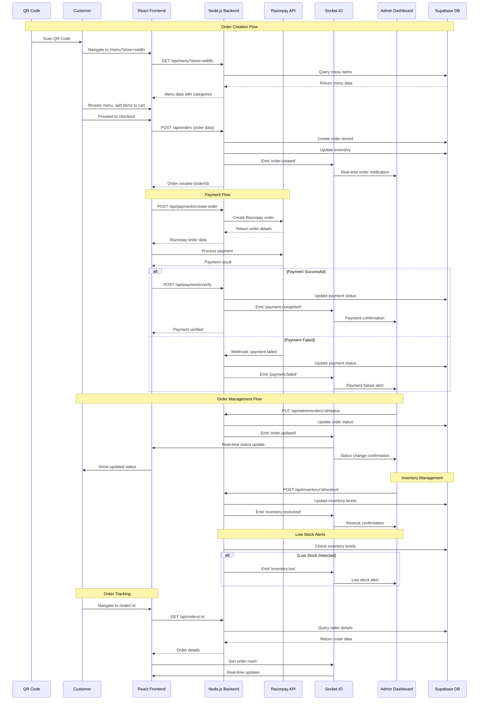

# SIDDHI Food Ordering System - Sequence Diagram

## QR → Frontend → Create Order → Razorpay → Webhook → Backend updates → Socket emit → Admin updates → Customer receives status

## Key Components and Interactions

### 1. QR Code to Menu Access
- Customer scans QR code
- Redirects to menu page with store parameter
- Frontend fetches menu data from backend

### 2. Order Creation
- Customer adds items to cart
- Submits order with customer details
- Backend creates order and updates inventory
- Real-time notification sent to admin

### 3. Payment Processing
- Frontend creates Razorpay order
- Customer completes payment
- Webhook confirms payment status
- Real-time updates sent to admin

### 4. Order Management
- Admin updates order status
- Real-time updates sent to customer
- Status changes reflected immediately

### 5. Inventory Management
- Admin restocks items
- Low stock alerts generated automatically
- Real-time inventory updates

### 6. Real-time Communication
- Socket.IO enables live updates
- Admin receives instant notifications
- Customer sees status changes immediately
